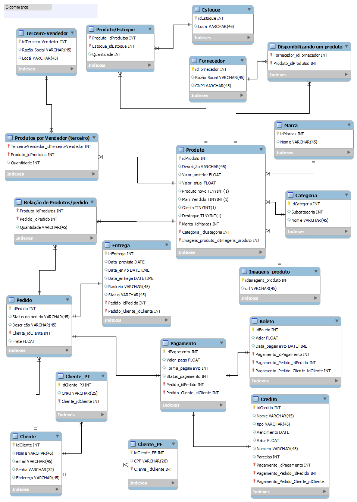

# Projeto Conceitual de Banco de dados - E-commerce

Neste modelo conceitual procurei trazer o mais próximo possível da realidade a estrutura de um e-commerce, que vai desde a parte em que o cliente se interessa por um produto e realiza a compra até a entrega do mesmo.
Nele também podemos ver a checagem de produtos em estoque e a verificação da disponibilidade de fornecedores.

# Modelo

